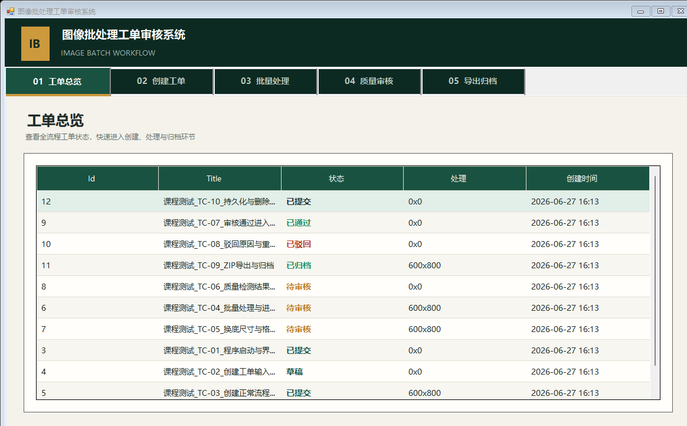

# 图像批处理工单审核系统测试报告

> 测试日期：2026-06-27  
> 测试人员：李嘉乐（AI辅助测试）  
> 测试版本：v1.0.0.0（Debug）  
> 测试结论：10项通过，0项失败

## 1. 测试目标

验证“创建工单—批量处理—质量检测—人工审核—导出归档”的业务闭环，重点检查状态流转、SQLite持久化、图片输出、ZIP归档和缺陷修复效果。

本轮在Visual Studio实际运行目录中建立10个独立测试工单。数据库为`WindowsFormsApp_3/bin/Debug/AppData/database.db`。原有用户工单予以保留，未被测试数据覆盖。

## 2. 测试环境与数据

| 项目 | 内容 |
|---|---|
| 操作系统 | Windows 11 |
| 开发工具 | Visual Studio 2022 |
| 运行框架 | .NET Framework 4.8 |
| 数据库 | SQLite 3.x |
| 测试图片 | 清晰图、模糊图、明显偏色图、BMP图 |
| 验证方式 | 独立C#测试驱动、SQLite查询、文件/ZIP检查、WinForm截图 |

实际测试数据包括10个独立工单、19条图片记录，状态覆盖`Draft`、`Submitted`、`PendingReview`、`Approved`、`Rejected`和`Archived`。

> **10个独立工单截图**
>
> 

## 3. 十组独立测试用例

| 编号 | ID | 独立测试工单 | 主要验证内容 | 最终状态 | 结果 |
|---|---:|---|---|---|---|
| TC-01 | 3 | 课程测试_TC-01_程序启动与界面导航 | 启动、数据库初始化、五页导航 | Submitted | 通过 |
| TC-02 | 4 | 课程测试_TC-02_创建工单输入校验 | 空标题、无图片校验 | Draft | 通过 |
| TC-03 | 5 | 课程测试_TC-03_创建正常流程工单 | 标题、3张图片和参数入库 | Submitted | 通过 |
| TC-04 | 6 | 课程测试_TC-04_批量处理与进度显示 | 3张图片处理及检测入库 | PendingReview | 通过 |
| TC-05 | 7 | 课程测试_TC-05_换底尺寸与格式输出 | 白底、600×800、PNG输出 | PendingReview | 通过 |
| TC-06 | 8 | 课程测试_TC-06_质量检测结果显示 | 模糊、分辨率和偏色检测 | PendingReview | 通过 |
| TC-07 | 9 | 课程测试_TC-07_审核通过进入导出列表 | 全部通过及导出列表显示 | Approved | 通过 |
| TC-08 | 10 | 课程测试_TC-08_驳回原因与重新处理 | 驳回、状态重置和重新处理 | Rejected | 通过 |
| TC-09 | 11 | 课程测试_TC-09_ZIP导出与归档 | ZIP、CSV、日志和归档状态 | Archived | 通过 |
| TC-10 | 12 | 课程测试_TC-10_持久化与删除回归 | 重启读取和关联数据删除 | Submitted | 通过 |

### TC-01 程序启动与界面导航

- **目标：** 检查程序启动、数据库连接和五个业务页面。
- **数据：** 工单ID 3，包含1张清晰图片。
- **预期：** 主界面正常显示，页面可切换，数据库可读取。
- **结果：** 程序启动正常，工单总览能够读取Debug数据库，五个页面均可访问。

### TC-02 创建工单输入校验

- **目标：** 检查标题和图片必填规则。
- **数据：** 工单ID 4作为空数据测试夹具，不包含图片。
- **预期：** 空标题和无图片均被拦截并给出正确提示。
- **结果：** 两项校验均生效，无效输入不能通过正常提交入口创建已提交工单。

### TC-03 创建正常流程工单

- **目标：** 检查工单、图片和处理参数保存。
- **数据：** 工单ID 5，3张图片，目标600×800 PNG。
- **预期：** 工单为`Submitted`，图片和参数写入数据库。
- **结果：** 3条图片记录及处理参数保存成功，原图目录完整。

### TC-04 批量处理与进度显示

- **目标：** 检查批量处理、进度回调和检测入库。
- **数据：** 工单ID 6，3张图片。
- **预期：** 图片3/3处理完成，生成3条检测记录并进入待审核。
- **结果：** 图片与检测记录均为3条，状态为`PendingReview`。

### TC-05 换底、尺寸与格式输出

- **目标：** 检查换底、缩放和格式转换。
- **数据：** 工单ID 7，清晰图、模糊图和偏色图。
- **预期：** 输出为白色背景、600×800 PNG。
- **结果：** 3张处理图均为600×800 PNG，原图未修改。

### TC-06 质量检测结果

- **目标：** 检查模糊度、分辨率、偏色和系统建议。
- **数据：** 工单ID 8，清晰图、模糊图和明显偏色图。
- **预期：** 模糊图和偏色图分别被正确标记不合格。
- **结果：** 清晰图模糊度242.81；模糊图0.01并判定不合格；偏色图通道差约45.06，大于阈值30并判定不合格。

### TC-07 审核通过并进入导出列表

- **目标：** 回归“审核完成后工单不进入导出列表”问题。
- **数据：** 工单ID 9。
- **预期：** 图片通过后自动推进；全部通过后为`Approved`并进入导出列表。
- **结果：** 工单状态为`Approved`，导出归档页面能够查询到该工单。

### TC-08 驳回与重新处理

- **目标：** 检查驳回原因、数据重置和重新处理入口。
- **数据：** 工单ID 10，驳回原因“背景边缘处理不完整”。
- **预期：** 工单为`Rejected`，图片与检测状态重置，可重新处理。
- **结果：** 图片恢复为`Pending`，检测记录清零，工单重新出现在处理列表。

### TC-09 ZIP导出与归档

- **目标：** 检查归档文件结构和状态更新。
- **数据：** 工单ID 11，3张原图和3张处理图。
- **预期：** ZIP包含原图、处理图、检测CSV和操作日志，状态为`Archived`。
- **结果：** `WorkOrder_11.zip`生成成功，共8个条目，工单状态为`Archived`。

### TC-10 数据持久化与删除回归

- **目标：** 检查数据库重连和关联数据删除。
- **数据：** 工单ID 12作为保留证据；临时工单ID 13用于删除验证。
- **预期：** ID 12重启后仍可读取；删除ID 13后无关联数据和目录残留。
- **结果：** ID 12持久化正常；ID 13及其关联数据、磁盘目录已清理。

## 4. TDD实践与缺陷回归

项目采用“测试条件先行—复现失败—最小修复—回归验证”的TDD方式。

| 缺陷 | 失败表现 | 修复方案 | 回归结果 |
|---|---|---|---|
| BUG-001 | 审核停留在同一图片，工单不能导出 | 查询最新状态并选择下一张未通过图片 | TC-07通过 |
| BUG-002 | 明显偏色图片仍判定合格 | 比较RGB通道最大、最小均值差 | TC-06通过 |
| BUG-003 | 驳回工单不能重新处理 | 处理列表同时加载Submitted和Rejected | TC-08通过 |
| BUG-004 | 删除后残留关联数据和目录 | 事务删除关联表并清理磁盘目录 | TC-10通过 |

## 5. 运行截图证据

| 截图 | 说明 |
|---|---|
| `TC-00-ten-independent-orders.png` | TC-01～TC-10独立工单总览 |
| `TC-03-create-input.png` | 创建工单输入界面 |
| `TC-04-processing-output.png` | 批量处理输出界面 |
| `TC-06-review-compare.png` | 原图、处理图与质量检测结果 |
| `TC-07-all-approved.png` | 全部图片审核通过 |
| `TC-07-export-list.png` | 已通过工单进入导出列表 |
| `TC-08-rejected.png` | 工单驳回并返回处理流程 |

## 6. 测试结论

本次共建立并验证10个独立测试工单，执行10项测试，通过10项，失败0项，通过率100%。原有用户工单得到保留。

系统能够完成工单创建、批量处理、质量检测、人工审核、驳回重处理、ZIP导出和数据清理。四项已知缺陷均完成修复与回归验证，RDD业务需求与TDD测试条件能够对应。

测试人员签名：李嘉乐  
测试完成日期：2026-06-27
